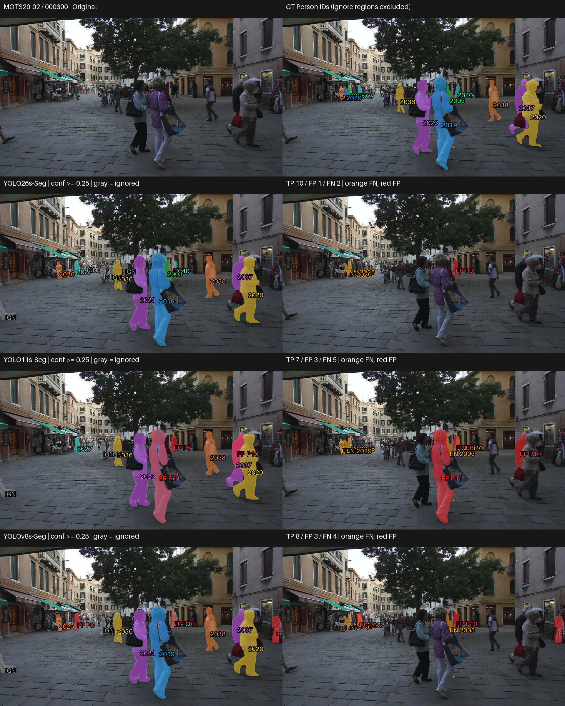
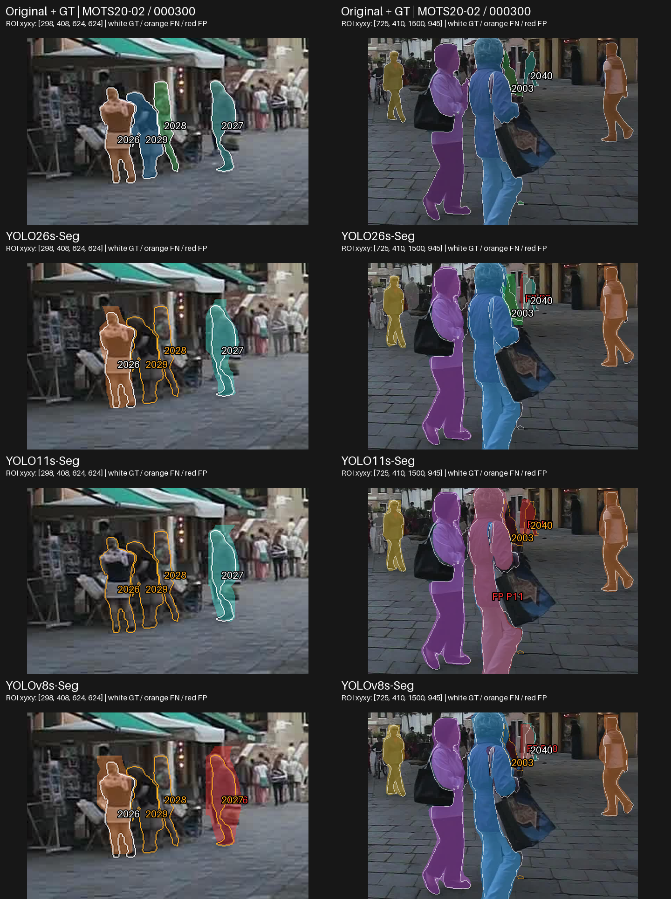
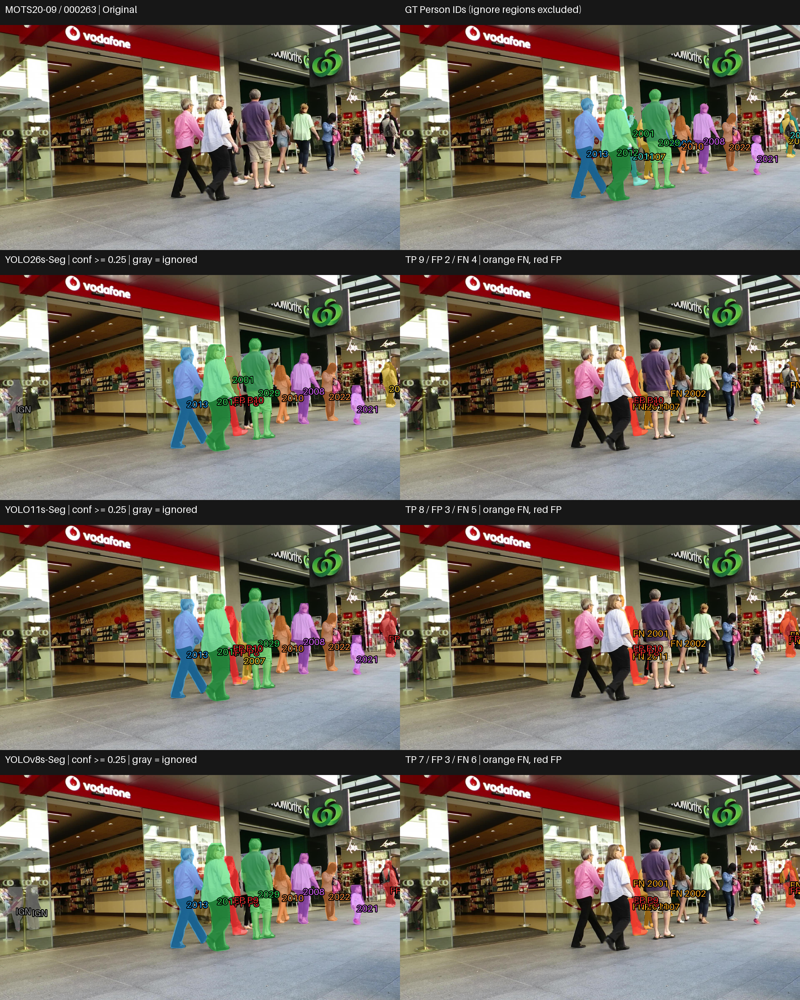
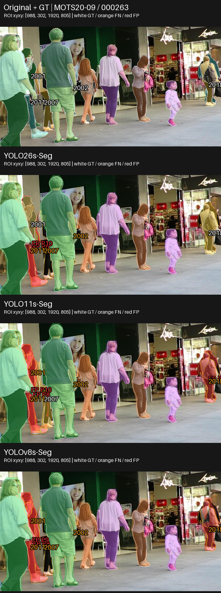
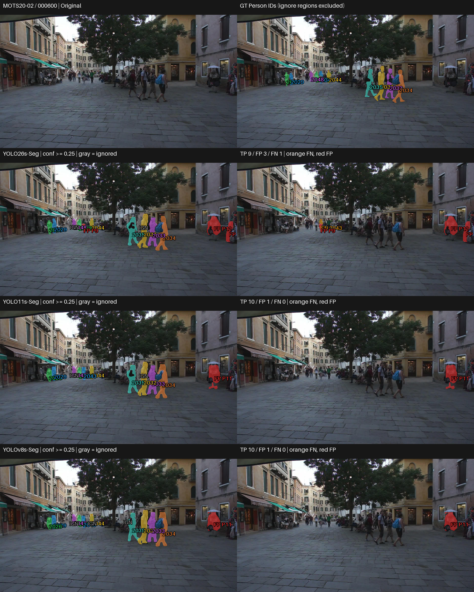
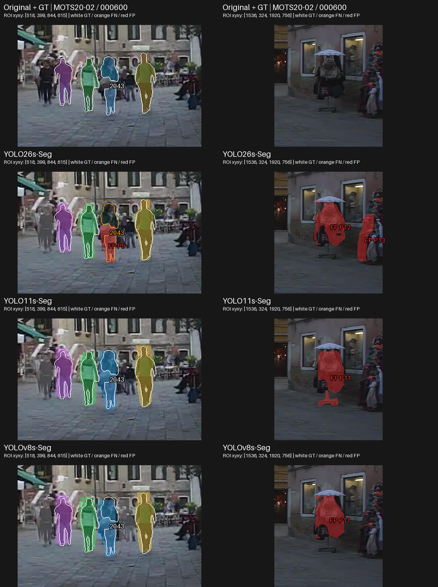
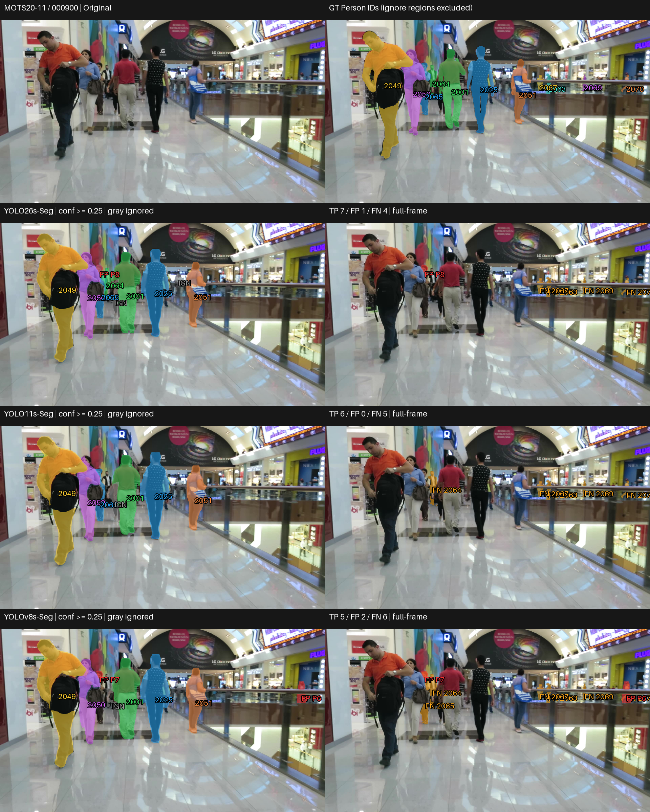
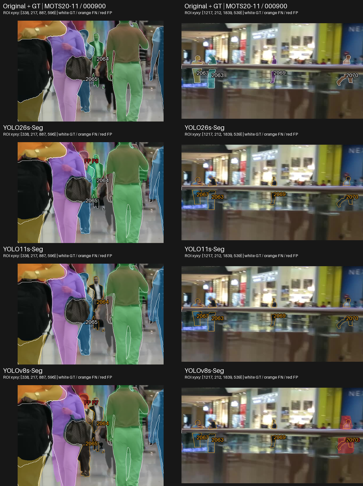

# Small (S) — Visual and Qualitative Analysis

## 1. ภาพรวมผลการทดลอง

Small เสร็จครบ 3 โมเดลบน MOTS20 2,862 เฟรม ด้วย pretrained / no fine-tuning และคงสถานะ PASS WITH WARNINGS เอกสารนี้เปรียบเทียบพฤติกรรมจาก prediction จริง ส่วนผลเชิงตัวเลขและ trade-off เต็มอยู่ที่ [RESULTS_SUMMARY_TH.md](RESULTS_SUMMARY_TH.md)

| Model | Mask mAP50-95 | AP75 | Recall |
|---|---|---|---|
| YOLO26s-Seg | 0.536640 | 0.586796 | 0.789581 |
| YOLO11s-Seg | 0.483269 | 0.513823 | 0.764148 |
| YOLOv8s-Seg | 0.482763 | 0.506411 | 0.767309 |

## การเลือกกรณีและการอ่านภาพ

คัด 4 กรณีจาก 12 เฟรมใน frozen visualization manifest โดยอ่าน per-frame TP/FP/FN และตรวจ original/GT กับ saved masks เลือก 1 shared anchor (Case 2: MOTS20-09 / 000263) และอีก 3 diagnostic cases ตามพฤติกรรมของ tier นี้ มีทั้งข้อได้เปรียบ ข้อผิดพลาดร่วม กรณีสวนอันดับ และ near-tie/ผลคล้ายกันเพื่อลด cherry-picking ไม่ใช่การสุ่มตัวแทน dataset
ภายในแต่ละ case ต้องใช้เฟรมเดียวกันครบทุกโมเดล ส่วนระหว่าง tier ใช้ภาพร่วมเมื่อมีเหตุผลในการเทียบ error เดียวกัน ไม่บังคับใช้ชุดภาพเหมือนกันทั้งหมด แต่ละ tier มี 4 cases; ชุดใหม่รวม 10 original frames ต่างกันจากเดิม 6 และเพิ่มฉาก MOTS20-11 ข้อมูลที่ซ้ำข้าม tier ไม่ใช่ตัวอย่างอิสระเพิ่ม
[CASE_SELECTION.md](outputs/visualizations/qualitative/selection_v2/CASE_SELECTION.md) บันทึกเหตุผลและแหล่งหลักฐาน
Small ไม่มี comparison เดิม จึงสร้างจาก lossless saved RLE และ original/GT โดยไม่โหลดโมเดลหรือรัน inference

แถวแรกเป็น Original/GT; แถวถัดมาเรียง YOLO26, YOLO11, YOLOv8 ซ้ายเป็น prediction ขวาเป็น unmatched overlay ทั้งหมดใช้ภาพเต็มเฟรมเดียวกันและ scale เท่ากัน สีของ matched mask ผูกกับ GT ID เดียวกัน; สีส้ม FN, สีแดง FP, สีเทา IGN (ignored prediction)
ใช้ confidence ≥0.25, mask matching IoU ≥0.50 และ ignore policy เดิม FN หมายถึง GT ที่ไม่มีคู่ผ่านเกณฑ์ อาจเกิดจาก mask ไม่ผ่าน IoU ไม่ใช่ไม่มี detection เสมอ FP หมายถึง prediction ที่ไม่ match valid GT และไม่ถูก ignore จึงไม่จำเป็นต้องเป็นคนที่ไม่มีอยู่จริง
GT panel แสดงเฉพาะ Person; IGN ไม่ถูกนับเป็น FP ตัวเลขรายเฟรมตรวจตรงกับ CSV เดิม

### Case เหล่านี้ช่วยตัดสินใจอย่างไร

ชุดนี้ใช้ประกอบการเลือกด้านความครบถ้วนของ instance และ unmatched output โดยอ่านร่วมกับ canonical metrics ไม่ได้ให้ผู้ชนะทุกภาพหรือใช้วัด latency/VRAM Case 2 เป็นเฟรมร่วมเพื่อเทียบข้อจำกัดบน source เดียวกัน อีก 3 cases เลือกตามพฤติกรรมของ tier; หากเฟรม diagnostic ตรงกับ tier อื่น เหตุผลต้องอยู่ใน CASE_SELECTION.md และไม่นับเป็นหลักฐานอิสระเพิ่ม 4 cases ไม่แทน 2,862 เฟรม

| Case | Pain point / บทบาท | ใช้ประกอบการเลือกด้านใด |
|---|---|---|
| 1 | จำแนกโมเดล: คนเล็กทางซ้ายและ GT ด้านหลังคู่คนใหญ่ | เป็น case ที่ช่วยเลือกด้าน coverage ได้ชัด: TP 10/7/8 และ FP 1/3/3 ของ YOLO26s/YOLO11s/YOLOv8s พร้อมตำแหน่ง GT ที่ต่างกัน |
| 2 | ข้อจำกัดร่วม / ต่าง GT: FN กลางกลุ่มคนและ error คนละ ID | ช่วยเห็นว่ายังมี FN ร่วม และ pair ที่ mAP near-tied อาจพลาดคนคนละชุด; ใช้ตรวจความครบถ้วนและ unmatched output ร่วมกัน |
| 3 | สวนอันดับ / near-tie: GT 2043 และ unmatched masks ริมขวา | ช่วยตรวจ pair near-tied YOLO11s/YOLOv8s ซึ่งเก็บ valid GT ครบ 10 ในเฟรมนี้ แต่ YOLO26s มี FN 2043 และ FP เพิ่ม |
| 4 | near-tie / GT–extra-mask trade-off: GT 2064/2065 ระหว่างคนและ GT หลังราวด้านขวา | ใช้เทียบ pair near-tied บนคนเดียวกัน: YOLO11s match 2065 ได้และไม่มี FP แต่ YOLOv8s พลาด 2065 พร้อม FP สอง mask; YOLO26s เก็บ 2064 เพิ่มแต่ยังมี FP |

ภาพขยายเป็น ROI เพิ่มเติมจาก original frames และ saved masks แถวแรก Original/GT ต่อด้วยโมเดลตามลำดับเดิม แต่ละคอลัมน์ใช้พิกัด/scale เดียวกันทุกโมเดล แถว Original/GT ใช้เส้นขาวแสดง valid GT; ในแถวโมเดลเส้นขาวคือ GT ที่ match เส้นส้มคือ FN; สีแดงคือ FP สีเทาคือ ignored prediction พิกัด ROI อยู่บนภาพ ภาพเต็มยังแสดงไว้เพื่อไม่ซ่อน error นอก ROI การขยายไม่เพิ่มรายละเอียดจากต้นฉบับ
ค่าราย GT ด้านล่างเป็น diagnostic ของ saved predictions ที่ confidence ≥0.25: TP ใช้ IoU ของคู่ที่ evaluator จับจริง; FN แสดง IoU สูงสุดของ candidate ที่มี ไม่ใช่ AP และไม่เปลี่ยน benchmark ตัวเลข TP/FP/FN ในคำอธิบายเป็นของเต็มเฟรม ไม่ใช่จำนวนใน ROI

## Case 1 — ความต่างในการเก็บ Person ขนาดเล็กและด้านหลัง

เหตุผลที่เลือก: แสดง instance ที่ตัวนำเก็บเพิ่ม พร้อมข้อผิดพลาดที่ยังมีร่วมกัน · MOTS20-02 / 000300

### ภาพเปรียบเทียบ

ภาพขยายจุดที่ต้องตรวจ (ใช้คู่กับภาพเต็มด้านบน):

### สิ่งที่เห็นจากภาพ

- YOLO26s match ได้ 10 instances เทียบกับ YOLO11s 7 และ YOLOv8s 8; YOLO26s เก็บ GT 2003 ด้านหลังคู่คนใหญ่กลางภาพได้ แต่อีกสองโมเดลมี FN ตรงนี้
- บริเวณคนตัวเล็กทางซ้าย YOLO26s/YOLOv8s match GT 2026 ขณะที่ YOLO11s มี FN; GT 2027 ถูก match ใน YOLO26s/YOLO11s แต่เป็น FN ใน YOLOv8s
- ทุกโมเดลมี FN ของ GT 2028/2029 ฝั่งซ้าย และยังมี FP: YOLO26s 1, YOLO11s/YOLOv8s อย่างละ 3 โดยบาง mask แดงทับบริเวณคนจริง

ตรวจ matching ราย GT จาก saved masks:

| GT | YOLO26s-Seg | YOLO11s-Seg | YOLOv8s-Seg |
|---|---|---|---|
| 2003 | TP IoU 0.530 | FN; best IoU 0.009 | FN; best IoU 0.020 |
| 2026 | TP IoU 0.757 | FN; best IoU 0.000 | TP IoU 0.686 |
| 2027 | TP IoU 0.617 | TP IoU 0.565 | FN; best IoU 0.474 |
| 2028 | FN; best IoU 0.000 | FN; best IoU 0.000 | FN; best IoU 0.000 |
| 2029 | FN; best IoU 0.003 | FN; best IoU 0.000 | FN; best IoU 0.002 |
| 2040 | TP IoU 0.620 | FN; best IoU 0.492 | TP IoU 0.590 |

IoU 0.000 คือค่าที่ปัดสามตำแหน่ง ไม่ยืนยันว่าไม่มี prediction; candidate อาจมีพื้นที่ทับ GT ต่ำหรือมีคู่กับ GT อื่นแล้ว FN จึงต้องอ่านร่วมกับภาพและ full-frame matching

### วิเคราะห์

คนใหญ่กลางภาพถูกเก็บในหลายโมเดล แต่ความต่างสำคัญอยู่ที่ instance ด้านหลังและคนตัวเล็กทางซ้าย การดูเฉพาะคนใหญ่จึงอาจซ่อนข้อผิดพลาดระดับ instance อีกทั้ง YOLO11s กับ YOLOv8s พลาดคนตัวเล็กคนละ ID แม้คะแนนรวมใกล้กัน การเก็บเพิ่มและการผ่าน mask matching ต้องพิจารณาร่วมกัน ไม่เรียก mask แดงบนคนจริงว่า nonexistent person โดยอัตโนมัติ

### เชื่อมกับผลเชิงตัวเลข

ตัวอย่างนี้สอดคล้องในทิศทางกับ Recall รวมของ YOLO26s 0.789581 ที่สูงกว่า YOLO11s 0.764148 และ YOLOv8s 0.767309 แต่ไม่อธิบายช่องว่างทั้ง dataset Mean matched-mask IoU ในเฟรมนี้คือ YOLO26s-Seg 0.748902; YOLO11s-Seg 0.759296; YOLOv8s-Seg 0.766392 ซึ่ง YOLO26s ไม่ได้สูงสุด ค่านี้เฉลี่ยจากชุด GT ที่ match ต่างกัน จึงไม่ควรสรุปคุณภาพขอบของคนเดียวกันจากค่าเฉลี่ยนี้

### ใช้ประกอบการเลือกอย่างไร

**Pain point / บทบาท:** จำแนกโมเดล — คนเล็กทางซ้ายและ GT ด้านหลังคู่คนใหญ่

**ใช้ประกอบการเลือก:** เป็น case ที่ช่วยเลือกด้าน coverage ได้ชัด: TP 10/7/8 และ FP 1/3/3 ของ YOLO26s/YOLO11s/YOLOv8s พร้อมตำแหน่ง GT ที่ต่างกัน

**ขอบเขตหลักฐาน:** GT 2040 ของ YOLO11s และ GT 2027 ของ YOLOv8s มี mask ใกล้เกณฑ์; การพลาดบาง GT คือ matching error ไม่ใช่ไม่มี detection

## Case 2 — ข้อผิดพลาดร่วมในกลุ่มคนกลางภาพ

เหตุผลที่เลือก: shared anchor ของทั้งห้า tier เพื่อเทียบข้อผิดพลาดบน source frame เดียวกัน;  แสดง FN/FP ที่ยังพบแม้ในโมเดลนำ แทนเลือกเฉพาะภาพที่ได้เปรียบ · MOTS20-09 / 000263

### ภาพเปรียบเทียบ

ภาพขยายจุดที่ต้องตรวจ (ใช้คู่กับภาพเต็มด้านบน):

### สิ่งที่เห็นจากภาพ

- ทุกโมเดลมี FN ของ GT 2002/2011 ในกลุ่มคนกลางภาพและ GT 2023 ริมขวา; GT บางส่วนมองเห็นเป็นพื้นที่เล็กอยู่ระหว่างคนอื่น
- YOLO26s/YOLO11s/YOLOv8s match ได้ 9/8/7 instances ตามลำดับ แต่ยังมี FP 2/3/3 masks รวม mask แดงในบริเวณคนกลางภาพ
- YOLO26s match GT 2001 ได้ ขณะที่ YOLO11s/YOLOv8s มี FN; GT 2007 ถูก match ใน YOLO11s แต่เป็น FN ในอีกสองโมเดล

ตรวจ matching ราย GT จาก saved masks:

| GT | YOLO26s-Seg | YOLO11s-Seg | YOLOv8s-Seg |
|---|---|---|---|
| 2001 | TP IoU 0.513 | FN; best IoU 0.313 | FN; best IoU 0.280 |
| 2002 | FN; best IoU 0.010 | FN; best IoU 0.010 | FN; best IoU 0.013 |
| 2007 | FN; best IoU 0.054 | TP IoU 0.622 | FN; best IoU 0.054 |
| 2011 | FN; best IoU 0.404 | FN; best IoU 0.376 | FN; best IoU 0.353 |
| 2018 | TP IoU 0.515 | FN; best IoU 0.464 | FN; best IoU 0.477 |

IoU 0.000 คือค่าที่ปัดสามตำแหน่ง ไม่ยืนยันว่าไม่มี prediction; candidate อาจมีพื้นที่ทับ GT ต่ำหรือมีคู่กับ GT อื่นแล้ว FN จึงต้องอ่านร่วมกับภาพและ full-frame matching

### วิเคราะห์

ทั้งสามโมเดลเก็บคนใหญ่ด้านหน้าได้หลายคน แต่ยังพลาดพื้นที่ GT ที่เล็กในกลุ่มคนซ้อนกัน การมี mask บริเวณคนไม่ได้รับรองว่าคู่นั้นผ่าน IoU เกณฑ์เดิม และ GT ที่เก็บได้มากกว่าโดยรวมในเฟรมยังไม่ชนะทุก instance ตัวอย่างนี้แสดงข้อจำกัดร่วมและ error ต่างตำแหน่ง โดยไม่จัดระดับความรุนแรงของ occlusion หรืออธิบายสาเหตุเชิง architecture

### เชื่อมกับผลเชิงตัวเลข

แม้ YOLO26s มี mAP/AP75/Recall รวมสูงสุด ก็ยังมี FN/FP ในกรณีนี้ Mean matched-mask IoU ของ YOLOv8s ในเฟรมสูงกว่า YOLO26s แต่มี TP น้อยกว่า จึงต้องระวัง selection ของคู่ที่ match เมื่ออ่าน TP-only quality การคำนวณอัตราผิดพลาดทั้ง dataset ต้องใช้ canonical metrics ไม่ขยายจำนวนจากเฟรมนี้

### ใช้ประกอบการเลือกอย่างไร

**Pain point / บทบาท:** ข้อจำกัดร่วม / ต่าง GT — FN กลางกลุ่มคนและ error คนละ ID

**ใช้ประกอบการเลือก:** ช่วยเห็นว่ายังมี FN ร่วม และ pair ที่ mAP near-tied อาจพลาดคนคนละชุด; ใช้ตรวจความครบถ้วนและ unmatched output ร่วมกัน

**ขอบเขตหลักฐาน:** Mean TP-only IoU ที่สูงกว่าใน YOLOv8s มาจากชุด TP ที่น้อยกว่า จึงไม่แทนความครบถ้วนของเฟรม

## Case 3 — กรณีสวนอันดับและ trade-off ของ matching

เหตุผลที่เลือก: ตัวอย่างที่ YOLO11s/YOLOv8s เก็บ valid Person ครบกว่า accuracy leader · MOTS20-02 / 000600

### ภาพเปรียบเทียบ

ภาพขยายจุดที่ต้องตรวจ (ใช้คู่กับภาพเต็มด้านบน):

### สิ่งที่เห็นจากภาพ

- YOLO11s และ YOLOv8s match valid GT ครบ 10 instances และไม่มี FN; YOLO26s match ได้ 9 โดยมี FN ของ GT 2043 ในกลุ่มคนตัวเล็กฝั่งซ้าย
- YOLO26s มี FP 3 masks เทียบกับอีกสองโมเดลอย่างละ 1; ทั้งสามมี mask แดงบริเวณคนใต้ร่มริมขวาที่ไม่ match valid GT ตาม benchmark
- ผลของ YOLO11s/YOLOv8s ดูใกล้กันในภาพเต็มเฟรม ทั้งกลุ่มคนด้านหน้าและคนตัวเล็กฝั่งซ้าย แต่ไม่ได้มี mask เหมือนกันทุกพิกเซล

ตรวจ matching ราย GT จาก saved masks:

| GT | YOLO26s-Seg | YOLO11s-Seg | YOLOv8s-Seg |
|---|---|---|---|
| 2043 | FN; best IoU 0.328 | TP IoU 0.565 | TP IoU 0.526 |

IoU 0.000 คือค่าที่ปัดสามตำแหน่ง ไม่ยืนยันว่าไม่มี prediction; candidate อาจมีพื้นที่ทับ GT ต่ำหรือมีคู่กับ GT อื่นแล้ว FN จึงต้องอ่านร่วมกับภาพและ full-frame matching

### วิเคราะห์

เฟรมนี้สวนอันดับรวมด้านความครอบคลุม: ตัวนำ dataset มี FN เพิ่มหนึ่ง instance และ FP มากกว่าอีกสองโมเดล บริเวณ FN 2043 ยังมี prediction ใกล้เคียงที่ไม่ match จึงไม่ควรตีความ FN ว่าไม่มี detection เสมอ ส่วน FP ใต้ร่มอยู่บริเวณคนจริง การนับตาม valid GT/ignore policy จึงต่างจากการดูว่ามีคนอยู่หรือไม่ ภาพเต็มเฟรมยังเก็บข้อผิดพลาดริมขวาไว้ให้ตรวจสอบ

### เชื่อมกับผลเชิงตัวเลข

YOLO26s มี Recall รวมสูงสุด แต่ไม่ได้มี TP สูงสุดทุกเฟรม Mean matched-mask IoU ในกรณีนี้คือ YOLO26s-Seg 0.707092; YOLO11s-Seg 0.640449; YOLOv8s-Seg 0.639208; YOLO26s สูงกว่าแต่มี FN/FP มากกว่า จึงแสดงว่าคุณภาพเฉพาะคู่ที่ match กับความครบถ้วนเป็นคนละด้าน AP75 ประเมิน confidence ranking และ stricter IoU จึงไม่เท่ากับ TP ที่ threshold 0.50 ในเฟรมเดียว

### ใช้ประกอบการเลือกอย่างไร

**Pain point / บทบาท:** สวนอันดับ / near-tie — GT 2043 และ unmatched masks ริมขวา

**ใช้ประกอบการเลือก:** ช่วยตรวจ pair near-tied YOLO11s/YOLOv8s ซึ่งเก็บ valid GT ครบ 10 ในเฟรมนี้ แต่ YOLO26s มี FN 2043 และ FP เพิ่ม

**ขอบเขตหลักฐาน:** อันดับ mAP/Recall รวมไม่รับรองทุกเฟรม; FP ใต้ร่มไม่จำเป็นต้องเป็นคนที่ไม่มีจริงตาม GT/ignore policy

## Case 4 — คู่ near-tied พลาดคนและเพิ่ม mask ต่างกัน

เหตุผลที่เลือก: ตรวจ YOLO11s/YOLOv8s ที่ mAP ใกล้กันในฉากที่เปิดให้เห็นทั้ง FN และ FP ต่างตำแหน่ง · MOTS20-11 / 000900

### ภาพเปรียบเทียบ

ภาพขยายจุดที่ต้องตรวจ (ใช้คู่กับภาพเต็มด้านบน):

### สิ่งที่เห็นจากภาพ

- YOLO26s match GT 2064/2065 ซึ่งอยู่ระหว่างคนใหญ่ด้านซ้าย; YOLO11s match 2065 แต่มี FN 2064; YOLOv8s มี FN ทั้งสอง GT
- ทุกโมเดลมี FN ของ GT 2063/2067/2069/2070 หลังราวด้านขวา; YOLOv8s ยังมี FP P6 ตรงบริเวณ GT 2070 โดย candidate IoU 0.316 ไม่ผ่าน matching
- YOLO26s มี FP P8 ทับบริเวณ GT 2065 ที่มีคู่แล้ว; YOLOv8s มี FP P7 บริเวณเดียวกันแต่ GT 2065 ยังเป็น FN ส่วน YOLO11s ไม่มี FP; TP/FP/FN คือ 7/1/4, 6/0/5, 5/2/6 ตามลำดับ

ตรวจ matching ราย GT จาก saved masks:

| GT | YOLO26s-Seg | YOLO11s-Seg | YOLOv8s-Seg |
|---|---|---|---|
| 2063 | FN; best IoU 0.000 | FN; best IoU 0.000 | FN; best IoU 0.000 |
| 2064 | TP IoU 0.611 | FN; best IoU 0.010 | FN; best IoU 0.236 |
| 2065 | TP IoU 0.711 | TP IoU 0.621 | FN; best IoU 0.160 |
| 2067 | FN; best IoU 0.000 | FN; best IoU 0.000 | FN; best IoU 0.000 |
| 2069 | FN; best IoU 0.000 | FN; best IoU 0.000 | FN; best IoU 0.000 |
| 2070 | FN; best IoU 0.000 | FN; best IoU 0.000 | FN; best IoU 0.316 |

IoU ที่ปัดเป็น 0.000 ไม่ยืนยันว่าไม่มี prediction; FN หมายถึงไม่มีคู่ผ่าน evaluator ตาม policy เดิม

### วิเคราะห์

เฟรมนี้แสดงสอง pain points ที่ต่างกัน: คนที่อยู่ระหว่างคนใหญ่ยังถูกพลาด และ output เพิ่มบนบริเวณคนจริง แม้ mask แดงจะดูเหมือนหาเจอคน ก็อาจเป็น FP ร่วมกับ FN เพราะพื้นที่ไม่ตรง GT พอ YOLO11s/YOLOv8s จึงไม่ได้มีพฤติกรรมเหมือนกันเพียงเพราะ mAP ใกล้กัน ขณะเดียวกัน YOLO26s เก็บเพิ่มได้แต่ไม่ได้แก้ GT หลังราวหรือหลีกเลี่ยง extra mask ทั้งหมด

### เชื่อมกับผลเชิงตัวเลข

YOLO11s/YOLOv8s มี mAP 0.483269/0.482763 ต่างประมาณ 0.000505; Case 3 ทั้งคู่มี TP/FP/FN เท่ากัน แต่เฟรมนี้ YOLO11s มี coverage มากกว่าและ FP น้อยกว่า จึงไม่เลือกจากความต่างทศนิยมท้าย ๆ เพียงอย่างเดียว Recall รวมของ YOLOv8s กลับสูงกว่า YOLO11s ส่วน coverage ของ YOLO26s ในกรณีนี้สอดคล้องกับ Recall รวมที่สูงกว่าโดยไม่พิสูจน์สาเหตุทั้ง dataset

### ใช้ประกอบการเลือกอย่างไร

**Pain point / บทบาท:** near-tie / GT–extra-mask trade-off — GT 2064/2065 ระหว่างคนและ GT หลังราวด้านขวา

**ใช้ประกอบการเลือก:** ใช้เทียบ pair near-tied บนคนเดียวกัน: YOLO11s match 2065 ได้และไม่มี FP แต่ YOLOv8s พลาด 2065 พร้อม FP สอง mask; YOLO26s เก็บ 2064 เพิ่มแต่ยังมี FP

**ขอบเขตหลักฐาน:** เฟรมนี้ไม่พิสูจน์ว่า YOLO11s เหนือกว่า YOLOv8s ทั้ง dataset เพราะ Recall รวมของ YOLOv8s สูงกว่า; GT หลังราวยังพลาดร่วมกันและ FN อาจมี prediction ที่ IoU ไม่ผ่าน

## Failure Analysis

| Failure pattern | Models observed | Visual case | Interpretation |
|---|---|---|---|
| Person ขนาดเล็ก / อยู่ด้านหลังไม่มีคู่ผ่านเกณฑ์ | ทุกโมเดล (2028/2029); YOLO11s/YOLOv8s (2003) | Case 1 | FN อาจรวม mask ที่ IoU ใกล้เกณฑ์ |
| Unmatched GT ในกลุ่มคน | ทุกโมเดล (2002/2011/2023) | Case 2 | พบ FN ร่วมและต่าง ID แม้คะแนนบางคู่ใกล้กัน |
| Unmatched GT ระหว่างคน / หลังราว | YOLO11s/YOLOv8s (2064); YOLOv8s (2065); ทุกโมเดล (2063/2067/2069/2070) | Case 4 | coverage ต่างกันและยังมีข้อจำกัดร่วม |
| Extra masks บนหรือใกล้คนจริง | YOLO26s/YOLOv8s ใน Case 4; ทุกโมเดลใน Case 2/3 | Case 2/3/4 | บาง FP ทับ GT ที่ match แล้ว บาง FP มาพร้อม FN; ไม่สรุป nonexistent person |

เป็นประเภท error ที่พบในกรณีที่เลือก ไม่ใช่อัตราหรือความถี่ทั้ง dataset ไม่ระบุ merging/fragmentation/boundary leakage หากไม่มีหลักฐานพอ

## Near-tie visual check

YOLO11s/YOLOv8s มี mAP 0.483269/0.482763 ต่างประมาณ 0.000505 บนสเกล 0–1 เป็น near tie เชิงพรรณนา Case 3 มี TP/FP/FN เท่ากันและ mask หลักดูใกล้กัน แต่ Case 1 พลาด GT คนละ ID ส่วน Case 4 YOLO11s เก็บ GT 2065 ที่ YOLOv8s พลาดและมี FP น้อยกว่า ภาพจึงมีทั้งความคล้ายและ error trade-off คะแนนใกล้กันไม่แปลว่า behavior เหมือนกัน AP75 รวมของ YOLO11s สูงกว่า ส่วน Recall รวมของ YOLOv8s สูงกว่า จึงไม่ขยายผลเฟรมเดียวเป็นความเหนือกว่าทั้ง dataset

## สิ่งที่เรียนรู้จากภาพจริง

### Observation 1

Case 1 ความต่างอยู่ที่ GT ด้านหลังและคนตัวเล็ก ขณะที่คนใหญ่ถูกเก็บในหลายโมเดล

**Interpretation:** การตรวจ instance เล็กเพิ่มข้อมูลที่ดูคนใหญ่เพียงอย่างเดียวไม่เห็น แต่ยังไม่สรุป robustness ต่อ scale ทั้ง dataset

### Observation 2

Case 2 ทุกโมเดลมี FN ร่วมและ mask แดงบนบริเวณคนจริง

**Interpretation:** การแบ่ง mask และการผ่าน matching เป็นคนละเรื่องกับการเห็นว่ามีคน ควรอ่าน FP/FN ร่วมกับ GT และ ignore policy

### Observation 3

Case 3 YOLO11s/YOLOv8s match คนได้ครบกว่า YOLO26s แม้คะแนนรวมต่ำกว่า

**Interpretation:** อันดับรวมไม่รับรองทุกเฟรม และ TP-only mask quality ไม่แทนความครบถ้วนของ GT

### Observation 4

Case 4 YOLO11s เก็บ GT 2065 และไม่มี FP แต่ YOLOv8s พลาด GT นี้และมี FP สอง mask; YOLO26s เก็บ 2064 เพิ่มพร้อม FP หนึ่ง mask

**Interpretation:** คู่ near-tied อาจได้คะแนนจาก trade-off คนละชนิด ต้องพิจารณาความครบถ้วนและ extra masks ร่วมกัน

## เมื่อดูทั้งตัวเลขและภาพร่วมกัน

mAP/AP75/Recall รวมของ YOLO26s สูงสุด และ Case 1 ช่วยเห็นการเก็บ instance เพิ่ม แต่ Case 2 ยังมีข้อผิดพลาดร่วม และ Case 3 สวนอันดับความครบถ้วน จึงไม่ควรใช้ภาพใดภาพหนึ่งอธิบายคะแนนทั้ง dataset ภาพที่ confidence 0.25 ไม่แสดง confidence ranking และทุก IoU threshold ที่ AP ใช้ ส่วน matched-mask IoU ในแต่ละกรณีอาจเฉลี่ยจาก GT คนละชุด ต้องแยกจาก Recall

Latency และ VRAM เป็น system-level measurements ต้องอ่าน benchmark แยกจากภาพ segmentation YOLOv8s forward เร็วสุด แต่ YOLO26s pipeline เร็วสุดและ VRAM ต่ำสุด; ภาพเหล่านี้ไม่สามารถวัดหรืออธิบายสาเหตุของเวลาและ memory ได้ Pipeline FPS ไม่รวม RLE preparation และ disk I/O

## ถ้าพิจารณาทั้งผลเชิงตัวเลขและภาพ

| Priority | Candidate | Evidence |
|---|---|---|
| Accuracy | YOLO26s-Seg | mAP/AP75/Recall รวมสูงสุด; Case 1 แสดง instance เพิ่ม แต่ Case 2/3 แสดงข้อจำกัด |
| Speed | YOLOv8s-Seg (inference); YOLO26s-Seg (pipeline) | Clean timing: 15.220 ms forward / 78.828 ms pipeline ตามลำดับ; ภาพไม่วัดเวลา |
| Low VRAM | YOLO26s-Seg | Peak allocated VRAM 872.67 MiB จาก memory benchmark; ภาพไม่วัด memory |
| Balanced | YOLO26s-Seg หากเน้น accuracy ร่วมกับ pipeline และ VRAM | นำทั้งสามด้านใน protocol นี้ แต่ forward 17.308 ms ช้ากว่า YOLOv8s; Case 3 แสดงข้อจำกัดเฉพาะเฟรมที่ควรพิจารณาประกอบ |

เป็น candidate สำหรับ cross-tier และ CCTV robustness evaluation ภายหลัง ไม่มี weighted score หรือข้อยืนยัน final CCTV superiority

## ข้อจำกัด

- เฟรมที่เลือกเป็นตัวอย่างเชิงคุณภาพจาก 12 เฟรมเดิม ไม่แทน dataset-level metrics และไม่ใช่ representative sample
- มีทั้งข้อได้เปรียบ ข้อผิดพลาดร่วม กรณีสวนอันดับ และผลคล้ายกันเพื่อลด cherry-picking; ยังอาจพลาด error ชนิดอื่นนอก selection pool
- MOTS20 ไม่ใช่ผลทดสอบ CCTV robustness ขั้นสุดท้าย ไม่อนุมาน blur/low-light/มุมกล้องหรือระดับ occlusion
- Qualitative observations และ numerical near ties ไม่ใช่ statistical significance
- ภาพย่อและ overlay อาจบังรายละเอียดขอบ ต้องตรวจ saved RLE หากต้องการข้อสรุประดับพิกเซล ไม่อธิบายสาเหตุจาก architecture

## รายละเอียดเต็ม

[Quantitative summary](RESULTS_SUMMARY_TH.md) · [REPORT.md](REPORT.md) · [TIER_RESULTS.csv](metrics/TIER_RESULTS.csv) ·
[Case evidence](outputs/visualizations/qualitative/selection_v2/CASE_EVIDENCE.json) ·
[Master Study](https://github.com/folklazy/YOLO_Instance_Segmentation_MOTS20_Scaling_Study)
