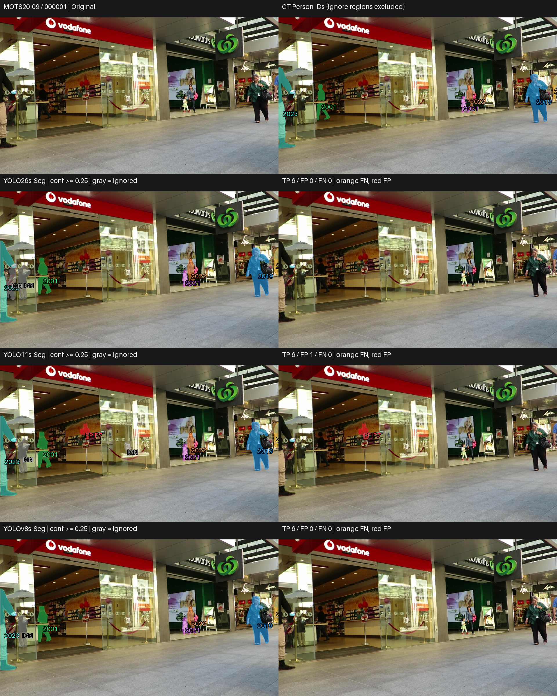

# Small (S) — Visual and Qualitative Analysis

## 1. ภาพรวมผลการทดลอง

Small เสร็จครบ 3 โมเดลบน MOTS20 2,862 เฟรม ด้วย pretrained / no fine-tuning และคงสถานะ PASS WITH WARNINGS เอกสารนี้เปรียบเทียบพฤติกรรมจาก prediction จริง ส่วนผลเชิงตัวเลขและ trade-off เต็มอยู่ที่ [RESULTS_SUMMARY_TH.md](RESULTS_SUMMARY_TH.md)

| Model | Mask mAP50-95 | AP75 | Recall |
|---|---|---|---|
| YOLO26s-Seg | 0.536640 | 0.586796 | 0.789581 |
| YOLO11s-Seg | 0.483269 | 0.513823 | 0.764148 |
| YOLOv8s-Seg | 0.482763 | 0.506411 | 0.767309 |

## การเลือกกรณีและการอ่านภาพ

คัด 4 กรณีจาก 12 เฟรมใน frozen visualization manifest โดยอ่าน per-frame TP/FP/FN และตรวจภาพจริง เลือกทั้งข้อได้เปรียบ ข้อผิดพลาดร่วม กรณีสวนอันดับ และผลคล้ายกันเพื่อลด cherry-picking ไม่ใช่การสุ่มตัวแทน dataset
[CASE_SELECTION.md](outputs/visualizations/qualitative/CASE_SELECTION.md) บันทึกเหตุผลและแหล่งหลักฐาน
Small ไม่มี comparison เดิม จึงสร้างจาก lossless saved RLE และ original/GT โดยไม่โหลดโมเดลหรือรัน inference

แถวแรกเป็น Original/GT; แถวถัดมาเรียง YOLO26, YOLO11, YOLOv8 ซ้ายเป็น prediction ขวาเป็น unmatched overlay ทั้งหมดใช้ภาพเต็มเฟรมเดียวกันและ scale เท่ากัน สีของ matched mask ผูกกับ GT ID เดียวกัน; สีส้ม FN, สีแดง FP, สีเทา IGN (ignored prediction)
ใช้ confidence ≥0.25, mask matching IoU ≥0.50 และ ignore policy เดิม FN หมายถึง GT ที่ไม่มีคู่ผ่านเกณฑ์ อาจเกิดจาก mask ไม่ผ่าน IoU ไม่ใช่ไม่มี detection เสมอ FP หมายถึง prediction ที่ไม่ match valid GT และไม่ถูก ignore จึงไม่จำเป็นต้องเป็นคนที่ไม่มีอยู่จริง
GT panel แสดงเฉพาะ Person; IGN ไม่ถูกนับเป็น FP ตัวเลขรายเฟรมตรวจตรงกับ CSV เดิม

## Case 1 — ความต่างในการเก็บ Person ขนาดเล็กและด้านหลัง

เหตุผลที่เลือก: แสดง instance ที่ตัวนำเก็บเพิ่ม พร้อมข้อผิดพลาดที่ยังมีร่วมกัน · MOTS20-02 / 000300

### ภาพเปรียบเทียบ

### สิ่งที่เห็นจากภาพ

- YOLO26s match ได้ 10 instances เทียบกับ YOLO11s 7 และ YOLOv8s 8; YOLO26s เก็บ GT 2003 ด้านหลังคู่คนใหญ่กลางภาพได้ แต่อีกสองโมเดลมี FN ตรงนี้
- บริเวณคนตัวเล็กทางซ้าย YOLO26s/YOLOv8s match GT 2026 ขณะที่ YOLO11s มี FN; GT 2027 ถูก match ใน YOLO26s/YOLO11s แต่เป็น FN ใน YOLOv8s
- ทุกโมเดลมี FN ของ GT 2028/2029 ฝั่งซ้าย และยังมี FP: YOLO26s 1, YOLO11s/YOLOv8s อย่างละ 3 โดยบาง mask แดงทับบริเวณคนจริง

### วิเคราะห์

คนใหญ่กลางภาพถูกเก็บในหลายโมเดล แต่ความต่างสำคัญอยู่ที่ instance ด้านหลังและคนตัวเล็กทางซ้าย การดูเฉพาะคนใหญ่จึงอาจซ่อนข้อผิดพลาดระดับ instance อีกทั้ง YOLO11s กับ YOLOv8s พลาดคนตัวเล็กคนละ ID แม้คะแนนรวมใกล้กัน การเก็บเพิ่มและการผ่าน mask matching ต้องพิจารณาร่วมกัน ไม่เรียก mask แดงบนคนจริงว่า nonexistent person โดยอัตโนมัติ

### เชื่อมกับผลเชิงตัวเลข

ตัวอย่างนี้สอดคล้องในทิศทางกับ Recall รวมของ YOLO26s 0.789581 ที่สูงกว่า YOLO11s 0.764148 และ YOLOv8s 0.767309 แต่ไม่อธิบายช่องว่างทั้ง dataset Mean matched-mask IoU ในเฟรมนี้คือ YOLO26s-Seg 0.748902; YOLO11s-Seg 0.759296; YOLOv8s-Seg 0.766392 ซึ่ง YOLO26s ไม่ได้สูงสุด ค่านี้เฉลี่ยจากชุด GT ที่ match ต่างกัน จึงไม่ควรสรุปคุณภาพขอบของคนเดียวกันจากค่าเฉลี่ยนี้

## Case 2 — ข้อผิดพลาดร่วมในกลุ่มคนกลางภาพ

เหตุผลที่เลือก: แสดง FN/FP ที่ยังพบแม้ในโมเดลนำ แทนเลือกเฉพาะภาพที่ได้เปรียบ · MOTS20-09 / 000263

### ภาพเปรียบเทียบ

### สิ่งที่เห็นจากภาพ

- ทุกโมเดลมี FN ของ GT 2002/2011 ในกลุ่มคนกลางภาพและ GT 2023 ริมขวา; GT บางส่วนมองเห็นเป็นพื้นที่เล็กอยู่ระหว่างคนอื่น
- YOLO26s/YOLO11s/YOLOv8s match ได้ 9/8/7 instances ตามลำดับ แต่ยังมี FP 2/3/3 masks รวม mask แดงในบริเวณคนกลางภาพ
- YOLO26s match GT 2001 ได้ ขณะที่ YOLO11s/YOLOv8s มี FN; GT 2007 ถูก match ใน YOLO11s แต่เป็น FN ในอีกสองโมเดล

### วิเคราะห์

ทั้งสามโมเดลเก็บคนใหญ่ด้านหน้าได้หลายคน แต่ยังพลาดพื้นที่ GT ที่เล็กในกลุ่มคนซ้อนกัน การมี mask บริเวณคนไม่ได้รับรองว่าคู่นั้นผ่าน IoU เกณฑ์เดิม และ GT ที่เก็บได้มากกว่าโดยรวมในเฟรมยังไม่ชนะทุก instance ตัวอย่างนี้แสดงข้อจำกัดร่วมและ error ต่างตำแหน่ง โดยไม่จัดระดับความรุนแรงของ occlusion หรืออธิบายสาเหตุเชิง architecture

### เชื่อมกับผลเชิงตัวเลข

แม้ YOLO26s มี mAP/AP75/Recall รวมสูงสุด ก็ยังมี FN/FP ในกรณีนี้ Mean matched-mask IoU ของ YOLOv8s ในเฟรมสูงกว่า YOLO26s แต่มี TP น้อยกว่า จึงต้องระวัง selection ของคู่ที่ match เมื่ออ่าน TP-only quality การคำนวณอัตราผิดพลาดทั้ง dataset ต้องใช้ canonical metrics ไม่ขยายจำนวนจากเฟรมนี้

## Case 3 — กรณีสวนอันดับและ trade-off ของ matching

เหตุผลที่เลือก: ตัวอย่างที่ YOLO11s/YOLOv8s เก็บ valid Person ครบกว่า accuracy leader · MOTS20-02 / 000600

### ภาพเปรียบเทียบ

### สิ่งที่เห็นจากภาพ

- YOLO11s และ YOLOv8s match valid GT ครบ 10 instances และไม่มี FN; YOLO26s match ได้ 9 โดยมี FN ของ GT 2043 ในกลุ่มคนตัวเล็กฝั่งซ้าย
- YOLO26s มี FP 3 masks เทียบกับอีกสองโมเดลอย่างละ 1; ทั้งสามมี mask แดงบริเวณคนใต้ร่มริมขวาที่ไม่ match valid GT ตาม benchmark
- ผลของ YOLO11s/YOLOv8s ดูใกล้กันในภาพเต็มเฟรม ทั้งกลุ่มคนด้านหน้าและคนตัวเล็กฝั่งซ้าย แต่ไม่ได้มี mask เหมือนกันทุกพิกเซล

### วิเคราะห์

เฟรมนี้สวนอันดับรวมด้านความครอบคลุม: ตัวนำ dataset มี FN เพิ่มหนึ่ง instance และ FP มากกว่าอีกสองโมเดล บริเวณ FN 2043 ยังมี prediction ใกล้เคียงที่ไม่ match จึงไม่ควรตีความ FN ว่าไม่มี detection เสมอ ส่วน FP ใต้ร่มอยู่บริเวณคนจริง การนับตาม valid GT/ignore policy จึงต่างจากการดูว่ามีคนอยู่หรือไม่ ภาพเต็มเฟรมยังเก็บข้อผิดพลาดริมขวาไว้ให้ตรวจสอบ

### เชื่อมกับผลเชิงตัวเลข

YOLO26s มี Recall รวมสูงสุด แต่ไม่ได้มี TP สูงสุดทุกเฟรม Mean matched-mask IoU ในกรณีนี้คือ YOLO26s-Seg 0.707092; YOLO11s-Seg 0.640449; YOLOv8s-Seg 0.639208; YOLO26s สูงกว่าแต่มี FN/FP มากกว่า จึงแสดงว่าคุณภาพเฉพาะคู่ที่ match กับความครบถ้วนเป็นคนละด้าน AP75 ประเมิน confidence ranking และ stricter IoU จึงไม่เท่ากับ TP ที่ threshold 0.50 ในเฟรมเดียว

## Case 4 — เก็บ valid Person เหมือนกัน แต่ FP ต่างกัน

เหตุผลที่เลือก: ตรวจผลที่ใกล้กันและ near-tied pair พร้อม error เฉพาะโมเดล · MOTS20-09 / 000001

### ภาพเปรียบเทียบ

### สิ่งที่เห็นจากภาพ

- ทุกโมเดล match valid GT ครบ 6 instances และไม่มี FN รวมคนใหญ่ริมขอบภาพและ Person ตัวเล็กบริเวณหน้าร้าน
- YOLO26s/YOLOv8s ไม่มี FP; YOLO11s มี FP เล็กหนึ่ง mask บริเวณฉากหลังร้านฝั่งซ้าย ซึ่งไม่ทับ valid GT Person
- Mask หลักดูคล้ายกันเมื่อดูเต็มเฟรม แต่รายละเอียดขอบและตำแหน่ง IGN ไม่ตรงกันทั้งหมด

### วิเคราะห์

หากดูเฉพาะ valid Person ภาพทั้งสามอาจดูแทบเหมือนกัน แต่การตรวจฉากหลังพบ error เพิ่มของ YOLO11s หนึ่งตำแหน่ง การเก็บคนครบจึงไม่ได้แปลว่า precision ของเฟรมเท่ากัน และ mAP รวมที่ near-tied ไม่ได้แปลว่า error เหมือนกัน ยังไม่มีฐานให้สรุปจาก FP ครั้งเดียวว่าโมเดลนี้มีปัญหาฉากหลังบ่อยกว่าทั้ง dataset

### เชื่อมกับผลเชิงตัวเลข

Mean matched-mask IoU ของเฟรมนี้คือ YOLO26s-Seg 0.781844; YOLO11s-Seg 0.765869; YOLOv8s-Seg 0.742147; ทุกโมเดลมี TP เท่ากัน แต่ overlap ไม่เท่ากัน และ YOLO11s มี FP เพิ่ม แม้ mAP รวมสูงกว่า YOLOv8s เล็กน้อย ตัวอย่างนี้ช่วยตีความว่าคะแนนใกล้กันอาจรวมผลจากข้อผิดพลาดต่างชนิด ไม่ใช่หลักฐาน statistical superiority ของรุ่นใด

## Failure Analysis

| Failure pattern | Models observed | Visual case | Interpretation |
|---|---|---|---|
| Missed / unmatched Person ขนาดเล็กหรืออยู่ด้านหลัง | ทุกโมเดล (2028/2029); YOLO11s/YOLOv8s (2003) | Case 1 | GT ไม่มีคู่ผ่านเกณฑ์ ไม่เท่ากับไม่มี detection ทุกครั้ง |
| Unmatched GT ในกลุ่มคนซ้อนกัน | ทุกโมเดล (2002/2011/2023) | Case 2 | พบข้อผิดพลาดร่วม ไม่ระบุสาเหตุหรือระดับ occlusion จากเฟรมเดียว |
| Unmatched mask บริเวณคนจริง | ทุกโมเดล | Case 2/3 | FP ตาม valid GT/ignore policy ไม่ใช่ nonexistent person โดยอัตโนมัติ |
| Extra mask บริเวณฉากหลังร้าน | YOLO11s | Case 4 | FP เฉพาะตัวอย่าง แม้ valid Person ถูก match ครบ |

ตารางนี้เป็นประเภท error ที่พบในกรณีที่เลือก ไม่ใช่ความถี่ทั้ง dataset ไม่ระบุ fragmentation, instance merging หรือ boundary leakage หากยังไม่มีหลักฐานพอ

## Near-tie visual check

YOLO11s/YOLOv8s มี mAP50-95 0.483269/0.482763 ต่างประมาณ 0.000505 บนสเกล 0–1 เป็น near tie เชิงพรรณนา ไม่ใช่ผลทดสอบนัยสำคัญ Case 3 มี TP/FP/FN เท่ากันและ mask ดูใกล้กัน แต่ Case 1 ทั้งคู่พลาด Person คนละ ID และ Case 4 YOLO11s มี FP เพิ่มในฉากหลัง จึงมีทั้งความคล้ายและ error trade-off ที่คะแนนรวมใกล้กันไม่ได้แสดงทั้งหมด
AP75 รวมของ YOLO11s สูงกว่า ส่วน Recall รวมของ YOLOv8s สูงกว่า แต่กรณีที่เลือกไม่ได้พิสูจน์ว่านี่เป็นพฤติกรรมประจำทุกเฟรม

## สิ่งที่เรียนรู้จากภาพจริง

### Observation 1

Case 1 ความต่างอยู่ที่ GT ด้านหลังและคนตัวเล็ก ขณะที่คนใหญ่ถูกเก็บในหลายโมเดล

**Interpretation:** การตรวจ instance เล็กเพิ่มข้อมูลที่ดูคนใหญ่เพียงอย่างเดียวไม่เห็น แต่ยังไม่สรุป robustness ต่อ scale ทั้ง dataset

### Observation 2

Case 2 ทุกโมเดลมี FN ร่วมและ mask แดงบนบริเวณคนจริง

**Interpretation:** การแบ่ง mask และการผ่าน matching เป็นคนละเรื่องกับการเห็นว่ามีคน ควรอ่าน FP/FN ร่วมกับ GT และ ignore policy

### Observation 3

Case 3 YOLO11s/YOLOv8s match คนได้ครบกว่า YOLO26s แม้คะแนนรวมต่ำกว่า

**Interpretation:** อันดับรวมไม่รับรองทุกเฟรม และ TP-only mask quality ไม่แทนความครบถ้วนของ GT

### Observation 4

Case 4 ทุกโมเดลเก็บ valid GT ครบ แต่ YOLO11s มี FP ในฉากหลังเพิ่ม

**Interpretation:** ความคล้ายของ mask คนและ near-tied mAP อาจซ่อน error ที่ต่างชนิดหรือตำแหน่ง จึงไม่เลือกจากทศนิยมท้าย ๆ หรือภาพเดียว

## เมื่อดูทั้งตัวเลขและภาพร่วมกัน

mAP/AP75/Recall รวมของ YOLO26s สูงสุด และ Case 1 ช่วยเห็นการเก็บ instance เพิ่ม แต่ Case 2 ยังมีข้อผิดพลาดร่วม และ Case 3 สวนอันดับความครบถ้วน จึงไม่ควรใช้ภาพใดภาพหนึ่งอธิบายคะแนนทั้ง dataset ภาพที่ confidence 0.25 ไม่แสดง confidence ranking และทุก IoU threshold ที่ AP ใช้ ส่วน matched-mask IoU ในแต่ละกรณีอาจเฉลี่ยจาก GT คนละชุด ต้องแยกจาก Recall

Latency และ VRAM เป็น system-level measurements ต้องอ่าน benchmark แยกจากภาพ segmentation YOLOv8s forward เร็วสุด แต่ YOLO26s pipeline เร็วสุดและ VRAM ต่ำสุด; ภาพเหล่านี้ไม่สามารถวัดหรืออธิบายสาเหตุของเวลาและ memory ได้ Pipeline FPS ไม่รวม RLE preparation และ disk I/O

## ถ้าพิจารณาทั้งผลเชิงตัวเลขและภาพ

| Priority | Candidate | Evidence |
|---|---|---|
| Accuracy | YOLO26s-Seg | mAP/AP75/Recall รวมสูงสุด; Case 1 แสดง instance เพิ่ม แต่ Case 2/3 แสดงข้อจำกัด |
| Speed | YOLOv8s-Seg (inference); YOLO26s-Seg (pipeline) | Clean timing: 15.220 ms forward / 78.828 ms pipeline ตามลำดับ; ภาพไม่วัดเวลา |
| Low VRAM | YOLO26s-Seg | Peak allocated VRAM 872.67 MiB จาก memory benchmark; ภาพไม่วัด memory |
| Balanced | YOLO26s-Seg หากเน้น accuracy ร่วมกับ pipeline และ VRAM | นำทั้งสามด้านใน protocol นี้ แต่ forward 17.308 ms ช้ากว่า YOLOv8s; Case 3 แสดงข้อจำกัดเฉพาะเฟรมที่ควรพิจารณาประกอบ |

เป็น candidate สำหรับ cross-tier และ CCTV robustness evaluation ภายหลัง ไม่มี weighted score หรือข้อยืนยัน final CCTV superiority

## ข้อจำกัด

- เฟรมที่เลือกเป็นตัวอย่างเชิงคุณภาพจาก 12 เฟรมเดิม ไม่แทน dataset-level metrics และไม่ใช่ representative sample
- มีทั้งข้อได้เปรียบ ข้อผิดพลาดร่วม กรณีสวนอันดับ และผลคล้ายกันเพื่อลด cherry-picking; ยังอาจพลาด error ชนิดอื่นนอก selection pool
- MOTS20 ไม่ใช่ผลทดสอบ CCTV robustness ขั้นสุดท้าย ไม่อนุมาน blur/low-light/มุมกล้องหรือระดับ occlusion
- Qualitative observations และ numerical near ties ไม่ใช่ statistical significance
- ภาพย่อและ overlay อาจบังรายละเอียดขอบ ต้องตรวจ saved RLE หากต้องการข้อสรุประดับพิกเซล ไม่อธิบายสาเหตุจาก architecture

## รายละเอียดเต็ม

[Quantitative summary](RESULTS_SUMMARY_TH.md) · [REPORT.md](REPORT.md) · [TIER_RESULTS.csv](metrics/TIER_RESULTS.csv) ·
[Case evidence](outputs/visualizations/qualitative/CASE_EVIDENCE.json) ·
[Master Study](https://github.com/folklazy/YOLO_Instance_Segmentation_MOTS20_Scaling_Study)
