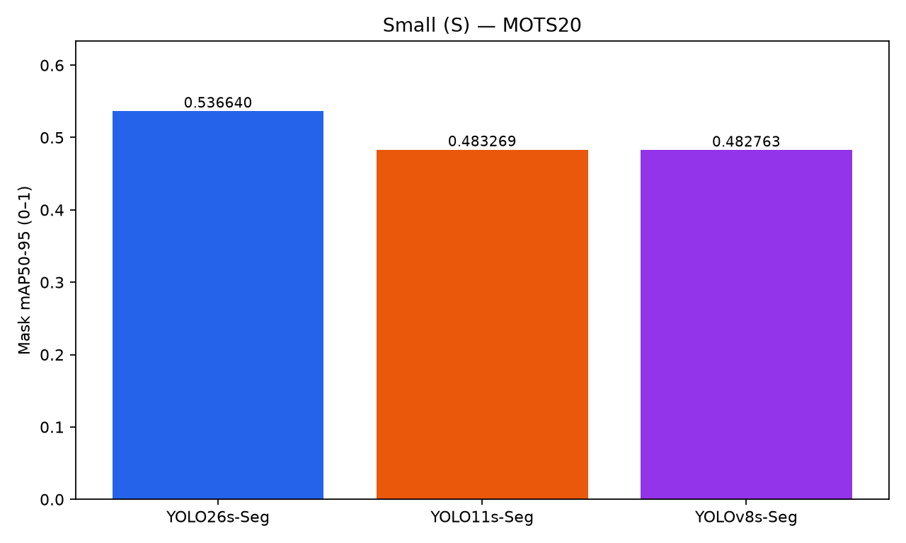
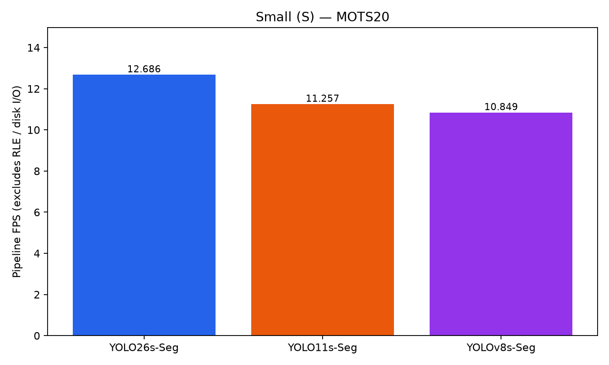
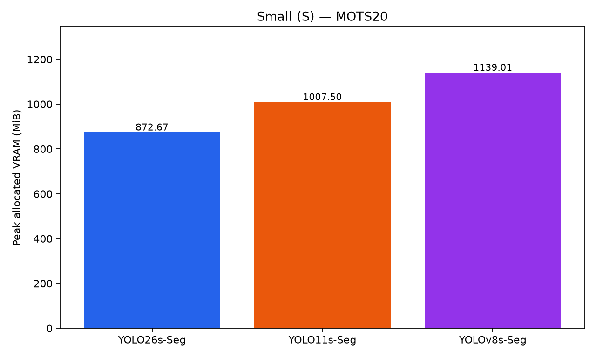

# Small

## สรุปแบบกระชับ

- ทดสอบ YOLO26s-Seg, YOLO11s-Seg และ YOLOv8s-Seg สำหรับ Person instance segmentation
- MOTS20 2,862 frames และ 26,894 Person GT instances ใช้ pretrained / no fine-tuning ภายใต้ controlled benchmark เดียวกัน
- Accuracy สูงสุด: YOLO26s-Seg; AP75 สูงสุด: YOLO26s-Seg; Recall สูงสุด: YOLO26s-Seg
- Inference เร็วสุด: YOLOv8s-Seg; pipeline เร็วสุดและ FPS สูงสุด: YOLO26s-Seg
- Peak allocated VRAM ต่ำสุด: YOLO26s-Seg
- คู่ที่ใกล้ที่สุดด้าน Mask mAP50-95: YOLO11s-Seg / YOLOv8s-Seg ต่าง 0.000505 — near-tied descriptively; ไม่ได้ทดสอบ statistical significance
- สถานะ PASS WITH WARNINGS; pipeline FPS ไม่รวม RLE preparation และ disk I/O

## โมเดลที่ทดสอบ

1. YOLO26: `yolo26s-seg.pt`
2. YOLO11: `yolo11s-seg.pt`
3. YOLOv8: `yolov8s-seg.pt`

## 1. ผลลัพธ์หลัก

YOLO26s-Seg มี Mask mAP50-95 สูงสุด 0.536640 ส่วน YOLOv8s-Seg มี inference mean ต่ำสุด และ YOLO26s-Seg มี pipeline mean ต่ำสุด/ FPS สูงสุด

YOLO26s-Seg ใช้ peak allocated VRAM ต่ำสุด การเลือกต้องแยกเป้าหมาย accuracy, เวลา forward, pipeline และ memory ไม่ตีความความต่างเล็กมากเป็นความเหนือกว่าทางสถิติ

## 2. ผลรวมโมเดล

| Model | Mask mAP50-95 | AP50 | AP75 | Precision | Recall | F1 | TP-only IoU | TP-only Dice | Inference ms | Pipeline ms | FPS | Peak VRAM allocated (MiB) | Parameters |
| --- | --- | --- | --- | --- | --- | --- | --- | --- | --- | --- | --- | --- | --- |
| YOLO26s-Seg | 0.536640 | 0.837980 | 0.586796 | 0.890842 | 0.789581 | 0.837161 | 0.816347 | 0.894970 | 17.308 | 78.828 | 12.686 | 872.67 | 11,505,800 |
| YOLO11s-Seg | 0.483269 | 0.817429 | 0.513823 | 0.868267 | 0.764148 | 0.812887 | 0.793011 | 0.880512 | 15.693 | 88.836 | 11.257 | 1007.50 | 10,113,248 |
| YOLOv8s-Seg | 0.482763 | 0.817024 | 0.506411 | 0.867022 | 0.767309 | 0.814124 | 0.792418 | 0.880020 | 15.220 | 92.173 | 10.849 | 1139.01 | 11,821,056 |

## 3. สรุปผลจากตาราง

### YOLO26s-Seg

นำทั้ง AP50, AP75, mAP50-95, Precision, Recall และ TP-only IoU/Dice ในชุดนี้ จึงมีหลักฐานเชิงตัวเลขหลายด้านร่วมกัน ไม่ได้อาศัย AP50 เพียงค่าเดียว Recall 78.96% ยังเหลือ GT ที่พลาดหรือจับคู่ไม่ผ่าน; TP-only quality เป็นคุณภาพเฉพาะคู่ที่ผ่านการจับคู่และไม่อธิบายคนที่พลาด

สิ่งที่แลกคือ forward 17.308 ms ซึ่งช้าสุด แต่ postprocessing ที่วัด 59.810 ms ต่ำกว่าอีกสองโมเดล ทำให้ pipeline 78.828 ms เร็วสุดและ VRAM 872.67 MiB ต่ำสุด หากงานใช้ pipeline ตามนิยามนี้ รุ่นนี้นำทั้ง accuracy, pipeline และ memory; หากข้อจำกัดอยู่ที่ forward อย่างเดียวต้องเทียบ YOLOv8s เพิ่ม

### YOLO11s-Seg

mAP 0.483269 ใกล้ YOLOv8s (0.482763) มาก โดย AP75 0.513823 เทียบกับ 0.506411 และ TP-only IoU/Dice สูงกว่าเล็กน้อย แต่ Recall 76.41% ต่ำกว่า YOLOv8s (76.73%) จึงเป็นความต่างของ precision/คุณภาพคู่ที่ match กับความครบถ้วน มากกว่าจะสรุปว่าทุกด้านดีกว่า

forward 15.693 ms ช้ากว่า YOLOv8s เล็กน้อย แต่ pipeline 88.836 ms และ VRAM 1007.50 MiB ต่ำกว่า YOLOv8s มี loaded parameters น้อยสุดในสามรุ่นแต่ไม่ได้ชนะด้านเวลาและ VRAM การจัดอันดับ mAP ระหว่างคู่นี้สลับในบาง sequence: YOLOv8s สูงกว่าใน MOTS20-02 และ MOTS20-11 ส่วน YOLO11s สูงกว่าใน MOTS20-05 และ MOTS20-09 จึงไม่ควรเลือกจาก pooled mAP ทศนิยมท้าย ๆ อย่างเดียว

### YOLOv8s-Seg

จุดเด่นคือ inference 15.220 ms ต่ำสุดในกลุ่ม และ Recall 76.73% สูงกว่า YOLO11s แม้ mAP จะใกล้กัน ขณะที่ AP75 และ TP-only matched-mask quality ต่ำกว่าเล็กน้อย คู่นี้จึงมี trade-off ที่คะแนนรวมใกล้กันอาจบดบัง; ยังไม่มีการทดสอบนัยสำคัญ

postprocessing 75.255 ms สูงสุดใน timing ที่วัด ทำให้ pipeline 92.173 ms ช้าสุดแม้ forward เร็วสุด พร้อม VRAM 1139.01 MiB สูงสุด จึงควรใช้เป็นตัวเทียบเมื่อเน้น forward และเป็น baseline ของตระกูลเดิม ผลนี้ไม่พิสูจน์ว่า architecture รุ่นเก่าด้อยกว่าเสมอ เพราะ checkpoint และการฝึกเดิมไม่ได้ถูกควบคุมให้เหมือนกัน

## 4. Insight ที่สำคัญ

- Observation: YOLO26s-Seg มี Mask mAP50-95 สูงสุด 0.536640; ห่างอันดับถัดไป 0.053371 บนสเกล 0–1
- Observation: YOLO26s-Seg นำ AP75 และ YOLO26s-Seg นำ Recall
- Observation: forward เร็วสุดคือ YOLOv8s-Seg, pipeline เร็วสุดและ FPS สูงสุดคือ YOLO26s-Seg, VRAM ต่ำสุดคือ YOLO26s-Seg
- คู่ที่ใกล้ที่สุดด้าน Mask mAP50-95: YOLO11s-Seg / YOLOv8s-Seg ต่าง 0.000505 — near-tied descriptively; ไม่ได้ทดสอบ statistical significance
- Interpretation: การเลือกต้องแยก accuracy, forward, pipeline และ memory ไม่สรุปว่า parameters ต่ำกว่าจะเร็วหรือใช้ VRAM ต่ำกว่าเสมอ

## 5. Trade-off

### Accuracy

YOLO26s นำ mAP50-95, AP75 และ Recall; YOLO11s/YOLOv8s near-tied เชิงพรรณนาที่ mAP แต่ AP75 กับ Recall เรียงต่างกัน ไม่มีการทดสอบนัยสำคัญ

### Speed

YOLOv8s forward เร็วสุด 15.220 ms แต่ YOLO26s pipeline เร็วสุด 78.828 ms อันดับกลับกันเมื่อรวม postprocessing ซึ่งมี mean YOLO26s / YOLO11s / YOLOv8s เท่ากับ 59.810 / 71.443 / 75.255 ms ตามลำดับ นี่เป็นการแจกแจงเวลาที่วัดได้ ไม่ใช่ข้อพิสูจน์เหตุเชิง architecture

### Memory / Resource

YOLO26s allocated VRAM ต่ำสุด แม้ YOLO11s มี parameters ต่ำสุด จำนวน parameters/GFLOPs ไม่ใช้แทนผลวัด memory หรือ latency

### ภาพรวม

YOLO26s เป็นตัวนำเมื่อเน้น accuracy ร่วมกับ pipeline และ memory ใน protocol นี้; YOLOv8s เป็นตัวนำด้าน forward ไม่สร้าง weighted score และยังไม่ยืนยันผล CCTV robustness

## 6. ถ้าต้องเลือกจาก Tier นี้

| Priority | Recommended model | Reason |
|---|---|---|
| Accuracy | YOLO26s-Seg | Mask mAP50-95 สูงสุด |
| Speed | YOLOv8s-Seg (inference); YOLO26s-Seg (pipeline) | เลือกตามส่วนที่เป็นข้อจำกัด |
| Low VRAM | YOLO26s-Seg | peak allocated VRAM ต่ำสุด |
| Balanced trade-off | YOLO26s-Seg เป็นตัวเริ่มพิจารณาแบบเน้น accuracy | ใช้เมื่อยอมรับ latency และ VRAM ในตารางได้; ไม่มีผู้ชนะสมดุลแบบไม่ขึ้นกับข้อจำกัด และไม่มีคะแนนรวม |

## 7. ข้อควรระวังในการตีความ

ผลนี้เป็น Person instance segmentation รายเฟรมบน MOTS20 ไม่ใช่ MOTS tracking; 26,894 GT instances เป็น annotation รายเฟรม ไม่ใช่จำนวนคนไม่ซ้ำ TP-only IoU/Dice พิจารณาเฉพาะคู่ที่ match ได้ ภาพต่อเนื่องสัมพันธ์กันและไม่มีการทดสอบ statistical significance ผลยังไม่ยืนยัน blur, low-light, มุมกล้อง, ระดับ occlusion หรือ deployment suitability จึงใช้เพื่อเลือก candidate for later CCTV robustness evaluation เท่านั้น

พบคำเตือน CPU NNPACK ใน log Small; ไม่พบ pycocotools DeprecationWarning ใน log รอบนี้ และแยก pipeline FPS ออกจากระบบที่บันทึก masks ครบวงจร

## รายละเอียดเต็ม

[REPORT.md](REPORT.md) · [metrics/TIER_RESULTS.csv](metrics/TIER_RESULTS.csv) · [RESULTS_SUMMARY_TH.md](RESULTS_SUMMARY_TH.md) · [Master Study](https://github.com/folklazy/YOLO_Instance_Segmentation_MOTS20_Scaling_Study)
